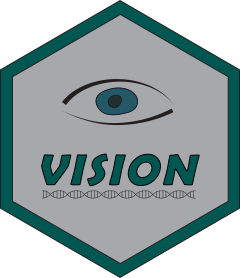

 [](https://travis-ci.org/YosefLab/VISION)

# Functional Interpretation for <br/> scRNA-seq Data

VISION aids in the interpretation of single-cell RNA-seq (scRNA-seq) data by selecting for gene signatures which describe coordinated variation between cells.  While the software only requires an expression matrix and a signature library (available in online databases), it is also designed to integrate into existing scRNA-seq analysis pipelines by taking advantage of precomputed dimensionality reductions, trajectory inferences or clustering results.  The results of this analysis are made available through a dynamic web-app which can be shared with collaborators without requiring them to install any additional software.

* [Nature Communications publication](https://www.nature.com/articles/s41467-019-12235-0)
* [Full Documentation](https://yoseflab.github.io/VISION/)
* [Biorxiv Preprint](https://www.biorxiv.org/content/early/2018/08/29/403055)

## Installing VISION

We recommend installing VISION via github using devtools:

```r
library(devtools)
install_github("YosefLab/VISION")
```

See the DESCRIPTION file for a complete list of R dependencies.  If the R dependencies are already installed, installation should finish in a few minutes.

## The VISION Pipeline

VISION generally follows the same pipeline from iteration to iteration, where minor differences can be specified via the various parameters in a VISION object. On a typical VISION run:

- For large datasets, or if the user so chooses, micropools are computed - grouping similar cells together to reduce the complexity of the analysis.
- If a latent space is not specified, PCA is performed and the top 30 components are retained.
- A KNN graph is constructed from the latent space, named the cell-cell similarity map
- Signature scores are computed using the expression matrix
- Signature local “consistencies” on the cell-cell similarity map are computed using the Geary-C statistic, an auto-correlation statistic.
- An interactive web-based report is generated that can be used to explore and interpret the dataset.

## How to run VISION

For general instructions on running VISION, see the [Getting Started](https://yoseflab.github.io/VISION/articles/VISION-vignette.html) vignette.

More information can be found throughout the rest of the tutorials on the [Documentation](https://yoseflab.github.io/VISION/) site.

## Sample Output


- [Live output example: ~9,000 CBMC's sequenced with the CITE-seq protocol](http://s133.cs.berkeley.edu:7703/)
- [Tour of the output report user interface(PDF)](https://github.com/YosefLab/VISION/raw/master/docs/VISION_Report_Manual.pdf)
