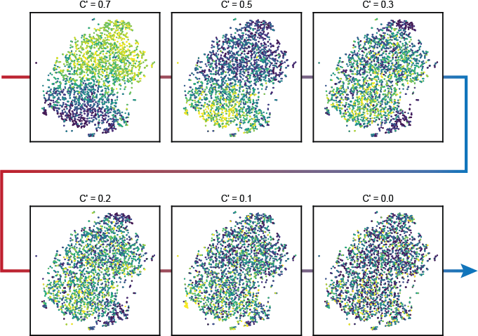

# What is signature autocorrelation?

When analyzing single-cell data using signatures, one goal would be to identify signatures whose values exhibit interesting patterns of variation in the dataset.

A labor-intensive way to do this would be to plot the expression scores of every signature on top of a visualization of the data (e.g. with tSNE or UMAP) and identify signatures whose scores vary in a coordinated manner.  The idea being that signatures that exhibit this property can be used to potentially describe features of the latent space.

VISION both automates this procedure and makes the process more quantitative.  A measure of global autocorrelation is evaluated for each signature in the latent space model.  This allows for a natural ranking of signatures as well as testing for significance.

To better understand this statistic, which varies from 0 (no autocorrelation to 1 (perfect autocorrelation), the graphic below shows a projection of single cells overlaid with signatures of 6 different autocorrelation values (labeled as C').

# Computing Autocorrelation

Signature autocorrelation captures the degree to which a cell's signature score is similar to that of its 'nearest neighbors' in a latent model of gene expression.  Or put another way, "Do cells with similar global expression also tend to have similar values for the gene signature being examined?" Signatures whose variation is largely composed of random technical noise would not behave in this way and cell-specific biases are controlled for in the calculation of signature scores (described [here](Signatures.html)).

As a measure of autocorrelation, we use the [Geary's C](https://en.wikipedia.org/wiki/Geary%27s_C) statistic.  To compute this statistic, two pieces of information are needed:

* 'weights' between measurements indicating how similar (e.g., nearby in the latent model) cells are to one another
* values to be compared against these weights

The values consist of the [signature scores](Signatures.html).  To calculate the weights, first the nearest $k$ neighbors are determined for each cell in the latent model.  If a latent space is provided as the latent model (or if it is computed using PCA), then nearest neighbors are determined using euclidean distance.  If a trajectory model is instead provided, neighbors are determined using the distance between cells along the trajectory.  Weights are then computed by applying a gaussian kernel to the distances between nearest neighbors such that higher weights are assigned to similar cells and the weight between distant cells is reduced to zero.

Finally, the autocorrelation statistic, C' is computed as:

$$
C' = 1-\frac{
	(N-1)\sum_i \sum_j w_{ij}(x_i-x_j)^2
}{
	2W\sum_i(x_i-\bar{x})^2
}
$$

* $x_{i}$ represents the signature score of cell $i$
* $w_{ij}$ is the weight between cells $i$ and $j$
* $W$ is the sum of all weights
* $N$ is the number of cells
* *Note*: This is actually 1 minus the Geary's C (which is why we label it as $C'$ instead of just $C$).  This alteration was made so that no autocorrelation occurs at a value of zero and maximal autocorrelation occurs at a value of one - which we found to be more intuitive due to its connection with other measures of correlation.

A permutation test using randomly-generated signatures (of similar size and positive-to-negative ratio) is used to assess the significance of these values.  However, due to the large number of cells involved in modern single-cell experiments, it is fairly easy to reject the null hypothesis and so the authors also recommend ranking and filtering using the C' values and not only the FDR rates (similar to how differential expression tests may be further filtered by the estimated log fold-change).

More details are [available in our Biorxiv preprint.](https://www.biorxiv.org/content/early/2018/09/28/403055)
